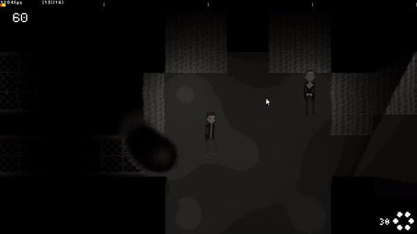

# Uncanny Detective

This work is licensed under a <a rel="license" href="http://creativecommons.org/licenses/by-nc-nd/4.0/">Creative Commons Attribution-NonCommercial-NoDerivatives 4.0 International License (CC-BY-NC-ND)</a>.
________________

**Engine - Game Maker: Studio 2**

**Language - Game Maker Language**

**Source Code - Available: Latest version**

**Executables - Lost**

**Development Date - 2020**

________________

## Description
A small Lovecraftian horror detective game where your dialog is based upon evidence and profiles you've collected, meaning that you have to "present" whatever you want to talk about to get any dialog. 

It wasn't finished because of my perpetual return to project h.o.p.e. and lack of clear direction of what I wanted to do with this game.

## Screenshots
 

## Videos
* [Test](https://youtu.be/psOrPC1bE4A)
* [Dialog](https://youtu.be/XpuZ9ZWg_QY)
